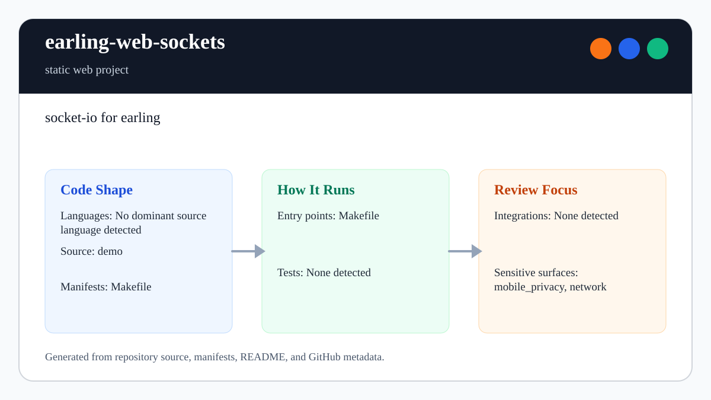

# earling-web-sockets

<!-- README-OVERVIEW-IMAGE -->


## Overview

`garethpaul/earling-web-sockets` is a static web project. socket-io for earling

This README is based on the checked-in source, manifests, scripts, and repository metadata on the `master` branch. The project language mix found during review was: no dominant source language detected.

## Repository Contents

- `README.md` - project overview and local usage notes
- `demo` - source or example code
- `Makefile` - local build or utility targets
- `SECURITY.md` - security reporting and disclosure guidance
- `VISION.md` - project direction and maintenance guardrails

Additional scan context:

- Source directories: demo
- Dependency and build manifests: Makefile
- Entry points or build surfaces: Makefile
- Test-looking files: no obvious test files detected

## Getting Started

### Prerequisites

- Git

### Setup

```bash
git clone https://github.com/garethpaul/earling-web-sockets.git
cd earling-web-sockets
```

The setup commands above are derived from repository files. Legacy mobile, Python, or JavaScript samples may require older SDKs or package versions than a modern workstation uses by default.

## Running or Using the Project

- Run `make` or inspect `Makefile` for available targets.

## Testing and Verification

- `make test` if the Makefile defines that target

When the required SDK or runtime is unavailable, use static checks and source review first, then verify on a machine that has the matching platform toolchain.

## Configuration and Secrets

- No required secret or credential file was identified in the repository scan. If you add integrations later, keep secrets out of git.

## Security and Privacy Notes

- Review changes touching network requests, sockets, or service endpoints; examples from the scan include demo/index.html, demo/index_ssl.html, rebar.config.

## Maintenance Notes

- See `SECURITY.md` for vulnerability reporting and safe research guidance.
- See `VISION.md` for project direction and contribution guardrails.

## Contributing

Keep changes small and tied to the project that is already present in this repository. For code changes, document the toolchain used, avoid committing generated dependency directories or local configuration, and update this README when setup or verification steps change.
